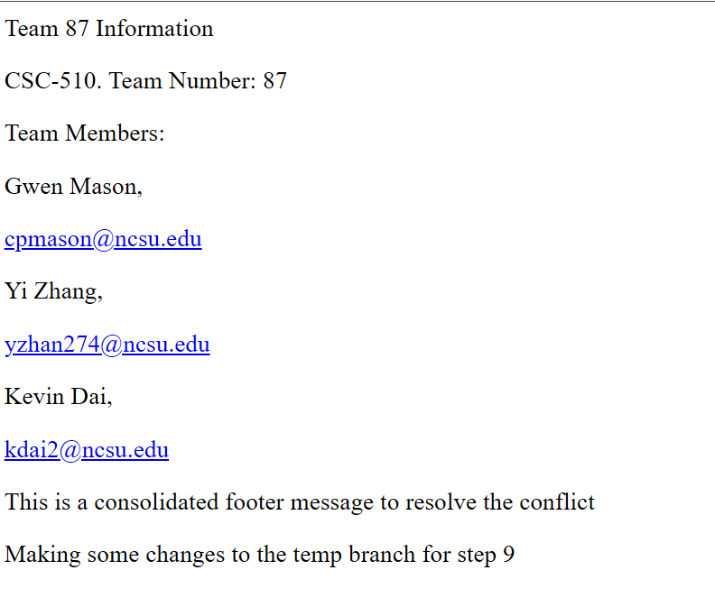

# git-homework

This repository contains a simple HTML page which gives some basic information about our team and each member.

It is meant for practice doing git commands on a git repository.

## Webpage Screenshot

